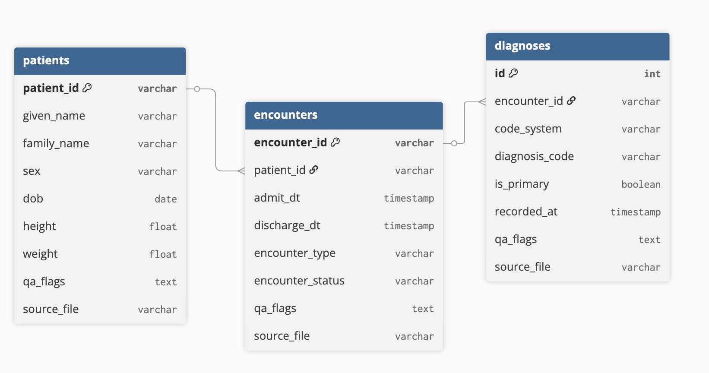

# Healthcare ETL Pipeline

A Python-based ETL pipeline that extracts healthcare data from CSV/XML files, transforms and validates it, and loads clean data into PostgreSQL with comprehensive data quality controls.

---

## Overview

This system:
1. **Extracts** patient, encounter, and diagnosis data from raw files
2. **Transforms** data with validation, deduplication, and referential integrity checks
3. **Loads** clean data into PostgreSQL database
4. **Monitors** data quality with an interactive dashboard

---

## Project Structure
```
healthcare-etl-pipeline/
├── src/healthcare_etl/
│   ├── core/              # Configuration and database setup
│   ├── extract/           # Data extraction from CSV/XML
│   ├── transform/         # Data cleaning and validation
│   ├── load/              # Database loading
│   ├── models/            # SQLAlchemy ORM models
│   ├── services/          # ETL orchestration
│   └── scripts/           # Runnable scripts
├── dashboard/             # Streamlit web dashboard
├── data/
│   ├── raw/              # Input files
│   ├── cleaned/          # Processed files
│   └── logs/             # Data quality logs
├── tests/                # Unit tests
├── docker-compose.yml    # PostgreSQL + Adminer setup
├── requirements.txt      # Python dependencies
└── setup.py             # Package installation
```

---

## Features

- **Multi-format Support** - Handles CSV and XML input files
- **Data Validation** - Type checking, format standardization, date logic validation
- **Referential Integrity** - Foreign key validation before database load
- **Duplicate Detection** - Automatic deduplication with survivorship rules
- **Comprehensive Logging** - All data quality issues tracked with flags
- **Interactive Dashboard** - Real-time data distribution and quality monitoring
- **Docker Support** - One-command database setup

---

## Data Model

| Table | Description |
|-------|-------------|
| **patients** | Patient demographic information |
| **encounters** | Hospital visits |
| **diagnoses** | Medical diagnoses linked to encounters |



The database consists of three main tables with referential integrity:

**Relationships:**
- One patient can have multiple encounters (1:N)
- One encounter can have multiple diagnoses (1:N)

**Key Points:**
- `patient_id` links encounters to patients
- `encounter_id` links diagnoses to encounters
- Foreign key constraints ensure data integrity
- `qa_flags` track data quality issues in each table
---

## Getting Started

### Prerequisites

- Python 3.10 or higher
- Docker and Docker Compose
- Git

### Installation
```bash
# 1. Clone repository
git clone https://github.com/emankhadim/healthcare-etl-pipeline.git
cd healthcare-etl-pipeline

# 2. Create virtual environment
python -m venv venv
source venv/bin/activate  # Windows: venv\Scripts\activate

# 3. Install package and dependencies
pip install -e .

# 4. Start PostgreSQL database
docker-compose up -d

# 5. Run ETL pipeline
python -m healthcare_etl.scripts.run_etl

# 6. Launch dashboard
streamlit run dashboard/app.py
```

---

## Usage

### Run ETL Pipeline
```bash
python -m healthcare_etl.scripts.run_etl
```

### Check Database Connection
```bash
python -m healthcare_etl.scripts.check_db
```

### View Dashboard
```bash
streamlit run dashboard/app.py
```

### Run Tests
```bash
pytest tests/ -v
```

---

## Data Quality Controls

The pipeline implements several data quality checks:

**Patients:**
- Duplicate detection on patient_id
- Date of birth validation
- Gender standardization

**Encounters:**
- Date logic validation (discharge >= admit)
- Patient foreign key validation
- Encounter type standardization
- Status tracking (OPEN/CLOSED)

**Diagnoses:**
- ICD-10 code format validation
- Encounter foreign key validation
- Primary diagnosis flagging

All rejected records are logged to `data/logs/` with detailed quality flags.

---

## Configuration

Database settings in `.env`:
```env
DB_USER=etl_user
DB_PASSWORD=etl_pass
DB_HOST=localhost
DB_PORT=5433
DB_NAME=healthcare_db
```

---

## Dashboard Features

The interactive dashboard provides:

- **Data Summary** - Record counts and quality scores
- **Patient Demographics** - Gender and age distribution
- **Encounter Distribution** - Visit types and status breakdown
- **Data Quality Report** - Detailed issue tracking with explanations
- **Data Explorer** - Browse and filter loaded data

---

## Development

### Project Dependencies

- pandas - Data manipulation
- SQLAlchemy - Database ORM
- psycopg2-binary - PostgreSQL driver
- streamlit - Dashboard framework
- plotly - Interactive charts
- pytest - Testing framework

### Adding Sample Data

Place your input files in `data/raw/`:
- `patients.csv`
- `encounters.csv`
- `diagnoses.xml`

Run the ETL to process them.

---

## Troubleshooting

**Database Connection Failed**
```bash
# Check if PostgreSQL is running
docker ps

# Restart database
docker-compose down
docker-compose up -d
```

**Import Errors**
```bash
# Reinstall package
pip install -e .
```

**Port Already in Use**
```bash
# Change port in docker-compose.yml
ports:
  - "5434:5432"  # Use different host port

# Update .env
DB_PORT=5434
```

---

## Architecture Decisions

**Why separate transform and load steps?**

I decided to validate and clean data before touching the database. This way, if there's a problem with the data, I catch it early in the transform step rather than during a database insert. This prevents messy rollbacks and makes it much easier to debug issues. I can just look at the log files to see exactly what failed validation and why.

**Why log everything that gets rejected?**

During development, I noticed that understanding *why* data was rejected was crucial. By keeping detailed logs of every rejected record with qa_flags, I can quickly identify patterns in data quality issues. For example, if I see multiple FK_VIOLATION errors, I know to check the source data ordering. These logs also help justify data cleaning decisions.

**Why check foreign keys during transform instead of letting the database handle it?**

The database will catch FK violations anyway, but at that point I have already done a lot of work. By checking FKs during the transform step, I avoid wasting time on database operations that will fail. Plus, I get much cleaner error messages in my logs that actually tell me which specific patient_id or encounter_id is missing.

---

## Author

Developed by **Eman Khadim**  
October 2025

--
